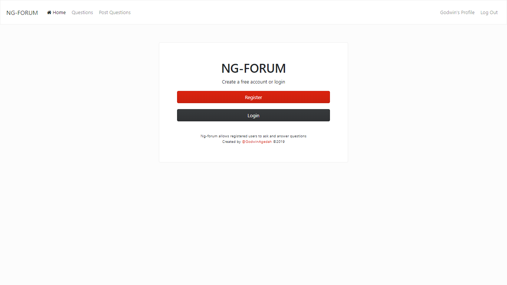
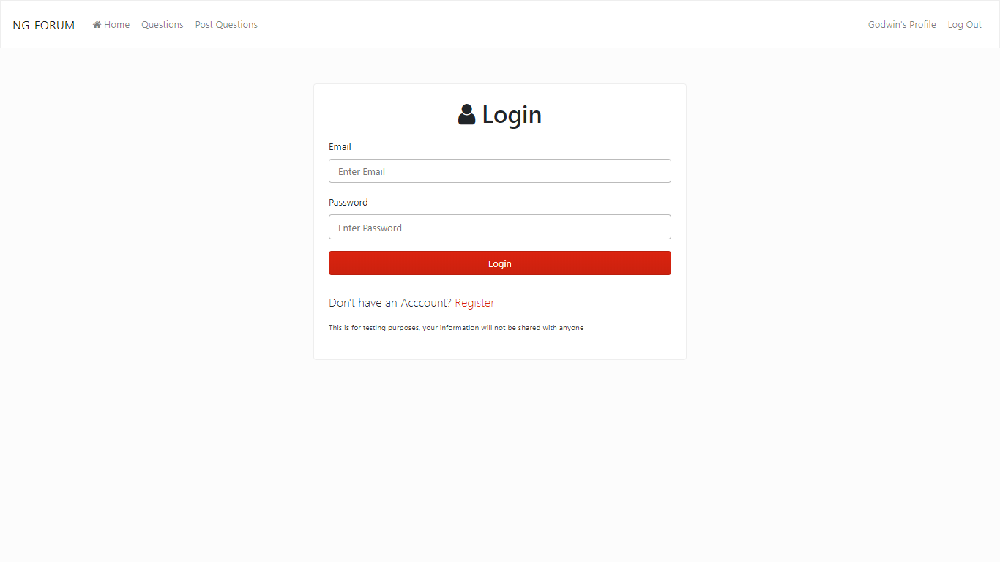
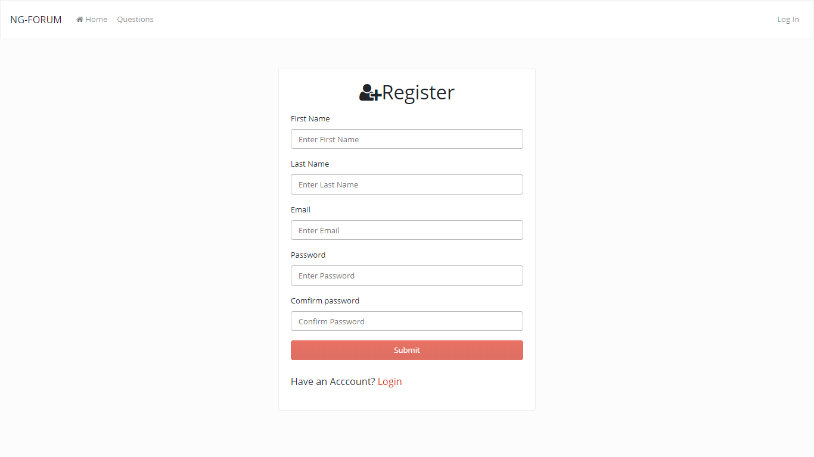
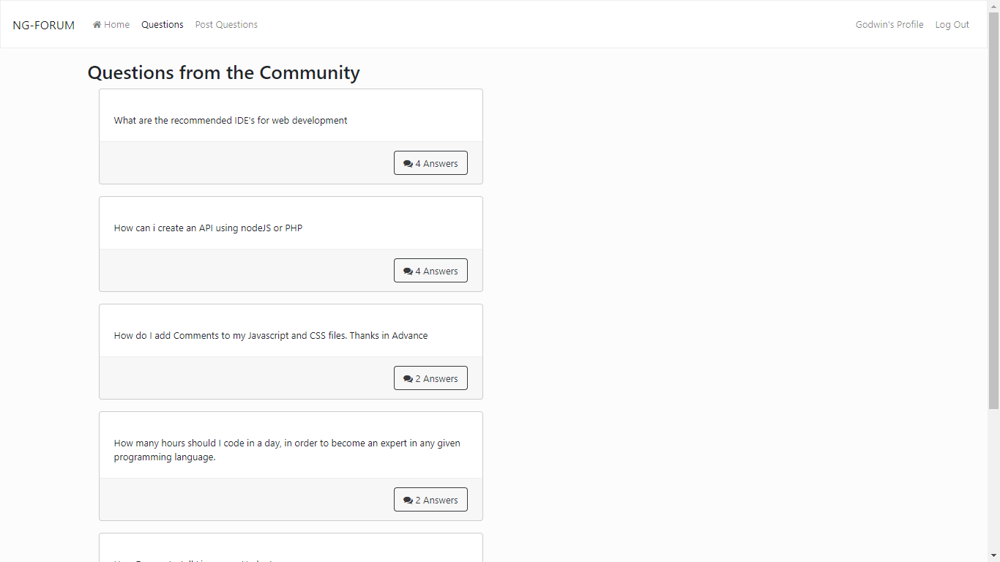
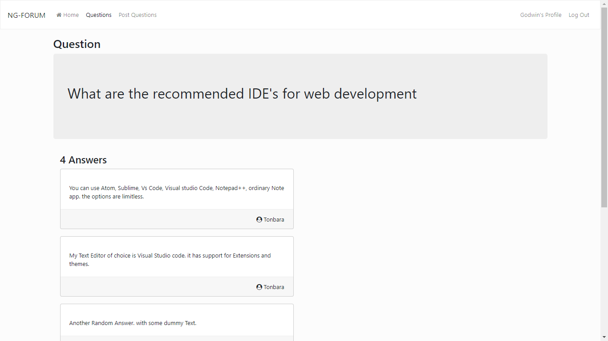

# NG FORUM

A MEAN app where Users can create an Account, Login, Ask and Post Questions for the community.

## What I learnt/did

### Frontend

Built with Angular and a Bootstrap theme from Bootswatch
* The Login page was built using Template driven form.
* I Used Reactive forms for the register page, reactive forms Declutter the HTML as validation is moved to the component.
* Using an Angular Service and Directives to control loading of DOM elements.
* Consuming API using Angular HTTPClient.
* Persisting User login through page refreshes.

### Backend

A NodeJS Backend using express to create the API endpoints, Passport for user authentication.
* Created an API for.
  * Registering New Users
  * Authenticating users
  * POST and GET Questions and Answers.
* Hashed Users Password with Bcrypt.
* Update Nested data in a mongodb collection. (Adding answers to an array of answers)

# Screenshots

# Side Fact

My first Angular project with user Authentication.

